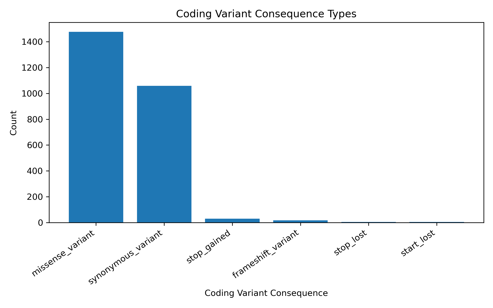

# 🧬 Whole-Exome Variant Analysis Pipeline (1000 Genomes)

## Project Goal
This project implements a complete bioinformatics pipeline to process whole-exome sequencing (WES) data from the 1000 Genomes Project, perform variant discovery, and analyze functional consequences of genomic variation.

The objective is to replicate real-world variant analysis workflows used in clinical genomics and derive biologically meaningful insights from population-scale sequencing data.

---

## Overview
This project presents an end-to-end WES analysis pipeline covering:

- Read alignment to the human reference genome (GRCh38)  
- Variant calling for SNPs and indels  
- Quality-based filtering of variants  
- Functional annotation using SnpEff  
- Downstream analysis of variant impact and consequence  

The workflow reflects standard pipelines used in research and precision medicine settings.

---

## Workflow Overview

1. Read alignment to reference genome  
2. BAM processing and quality control  
3. Variant calling (SNVs and indels)  
4. Variant filtering  
5. Functional annotation  
6. Coding variant analysis  

---

## Key Features

- End-to-end WES pipeline using Bash-based workflow  
- Variant calling using bcftools/GATK  
- Functional annotation of variants using SnpEff  
- Extraction and analysis of coding variants  
- Generation of biologically interpretable visualizations  

---

## Project Structure


wes-variant-analysis/
│── scripts/ # Pipeline scripts
│── data/ # Input data
│── results/
│ ├── vcf/ # Variant call files
│ ├── annotation/ # Annotated variants and summaries
│ ├── qc/ # Quality control metrics
│── figures/
│ ├── final/ # Final plots
│── README.md


---

## Workflow Details

### Alignment
- Reads aligned to GRCh38 reference genome  
- Generated sorted and indexed BAM files using samtools  

### BAM Processing
- Sorting and indexing performed  
- Alignment quality assessed  

### Variant Calling
- SNPs and indels identified using bcftools/GATK  
- Generated compressed VCF files  

### Filtering
- Applied quality thresholds to retain high-confidence variants  
- Removed low-quality and low-depth variants  

### Annotation
- Variants annotated using SnpEff  
- Functional effects categorized (e.g., intronic, missense, synonymous)  

### Coding Variant Analysis
- Extracted protein-coding variants  
- Focused on biologically meaningful mutation types  
- Generated consequence-level summaries  

---

## Results and Biological Insights

### Variant Impact Distribution

Most variants fall into the **MODIFIER category**, indicating that the majority of variants occur in non-coding regions such as introns and intergenic regions. High-impact variants are rare, which is consistent with population-level genomic data.

---

### Variant Consequence Distribution

Genome-wide analysis shows that:

- Intronic and intergenic variants dominate  
- Regulatory-region variants (upstream/downstream) are common  
- Coding variants represent a small but functionally important subset  

---

### Coding Variant Analysis

To focus on functional variation, coding variants were extracted and analyzed separately.



#### Key Findings

- **Missense variants are the most abundant coding mutations**, indicating frequent amino acid changes  
- **Synonymous variants are also highly represented**, serving as a neutral baseline  
- **High-impact variants (stop-gained, frameshift) are rare**, consistent with negative selection  
- The distribution reflects expected patterns of functional variation in human genomes  

---

### Gene-Level Variant Analysis

Top genes with high variant counts were identified. However:

- Variant counts are influenced by gene length and genomic coverage  
- Normalized gene-level analysis improves interpretability  

---

### Variant Statistics

Variant-level quality metrics were computed using bcftools:

- Total variants identified from filtered dataset  
- Distribution of SNPs and indels  
- Quality statistics used to ensure reliability  

---

## Outputs

- BAM files (aligned reads)  
- Filtered VCF files  
- Annotated variant datasets  
- Coding variant summaries  
- Quality control metrics  
- Visualization plots  

---

## Tools & Technologies

- Bash / Linux  
- Python  
- samtools  
- bcftools  
- SnpEff  
- GATK (optional)  

---

## Skills Demonstrated

- NGS data processing  
- Variant calling and filtering  
- Functional annotation  
- Biological interpretation of genomic data  
- Data visualization  
- Reproducible pipeline development  

---

## Impact

This project demonstrates workflows used in:

- Clinical genomics  
- Precision medicine  
- Variant interpretation  
- Biomarker discovery  

It highlights the ability to move from raw sequencing data to biologically meaningful insights.

---

## Reproducibility

```bash
conda env create -f environment.yml
conda activate wes-variant-analysis
bash scripts/run_pipeline.sh
```

## Author

Divya Reddy
MS Bioinformatics, Georgia Institute of Technology
